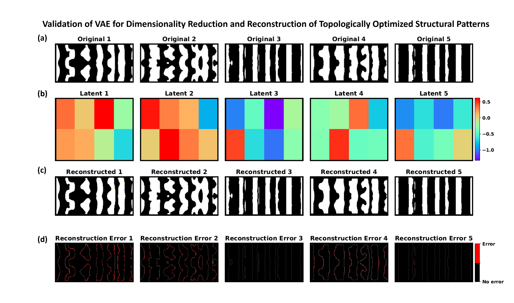
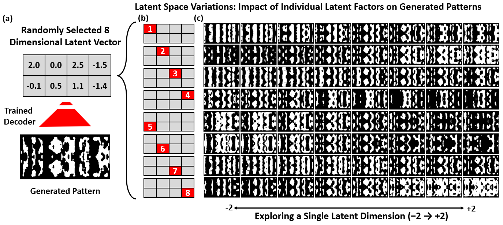
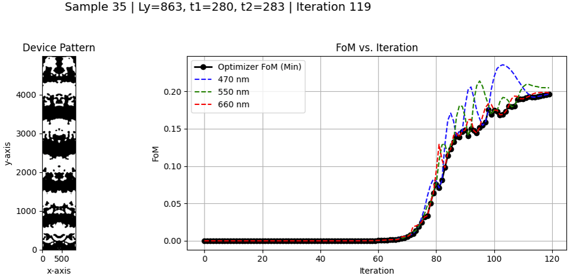
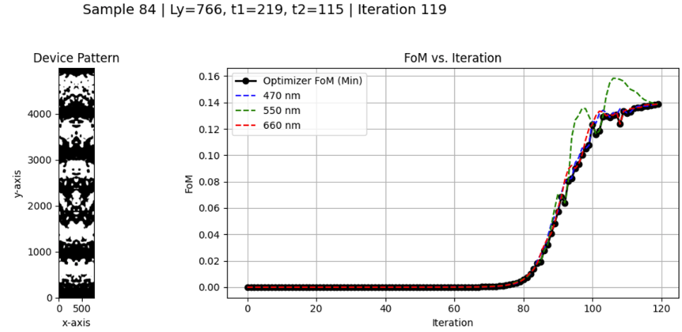

# HiLAB: A Hybrid Inverse-Design Framework

[](https://onlinelibrary.wiley.com/doi/full/10.1002/smtd.202500975)
[](https://doi.org/10.1002/smtd.202500975)

Official code repository for the paper:

> **HiLAB: A Hybrid Inverse-Design Framework**
> Reza Marzban, Hamed Abiri, Raphaël Pestourie, Ali Adibi
> *Small Methods*, 2025 — [https://doi.org/10.1002/smtd.202500975](https://doi.org/10.1002/smtd.202500975)

---

## Overview

HiLAB is a hybrid inverse-design framework for nanophotonic devices that combines:

1. **Early-terminated Topological Optimization (TO)** — generates a diverse library of freeform device candidates at reduced simulation cost
2. **Vision Transformer VAE (ViT-VAE)** — compresses the structural library into a compact 16-dimensional latent space
3. **Bayesian Optimization (BO)** — co-optimizes device geometry and hyperparameters within the latent space

This pipeline achieves an **order-of-magnitude reduction** in full electromagnetic simulations, demonstrated on an achromatic beam deflector with balanced ~25% diffraction efficiencies at 470 nm, 550 nm, and 660 nm.

```
Early-Stopped TO Library  →  ViT-VAE Latent Space  →  Bayesian Search  →  Optimized Device
     (diverse structures)         (z ∈ ℝ¹⁶)            (z + hyperparams)
```

---

## Sample Results

### VAE Reconstruction Validation

*Original structures (a), their 8-dimensional latent representations (b), reconstructions (c), and pixel-wise reconstruction error (d):*



### Latent Space Exploration

*Sweeping individual latent dimensions (−2 → +2) while keeping others fixed reveals smooth, meaningful variation in generated device patterns:*



### Optimizer Convergence

*Device patterns and FoM convergence across R/G/B wavelengths for two optimized samples:*





---

## Installation

```bash
git clone https://github.com/mr-marzban/HiLAB-A-Hybrid-Inverse-Design-Framework.git
cd HiLAB-A-Hybrid-Inverse-Design-Framework
pip install -r requirements.txt
```

---

## Usage

### 1. Build the model

```python
from src.model import ViTVAE, VAELoss

model = ViTVAE(latent_dim=16)
model.unfreeze_last_k_vit_blocks(k=2)   # fine-tune last 2 ViT blocks
```

### 2. Wrap your structure arrays into DataLoaders

```python
from src.model import make_loaders_from_arrays_flexible

# Arrays shape: (N, 256, 128, 3) or (N, 3, 128, 256), float32 in [0, 1]
train_loader, val_loader = make_loaders_from_arrays_flexible(
    train_images, test_images,
    batch_size=16,
    num_workers=4,
)
```

### 3. Train with VAE loss

```python
import torch

criterion = VAELoss(recon_type="mse", kl_weight=1e-3)
optimizer = torch.optim.Adam(
    [p for p in model.parameters() if p.requires_grad], lr=1e-4
)

for imgs, _ in train_loader:
    recon, mu, logvar = model(imgs)
    loss, _, _ = criterion(recon, imgs, mu, logvar)
    optimizer.zero_grad()
    loss.backward()
    optimizer.step()
```

### 4. Run the ViT fine-tuning sweep (ablation)

```python
from src.model import sweep_thaw_depths_with_loaders

results, curves = sweep_thaw_depths_with_loaders(
    train_loader, val_loader,
    thaw_depths=[0, 1, 2, 4, 6, 12],
    epochs_per_setting=5,
    latent_dim=16,
    recon_type="mse",
    kl_weight=1e-3,
    lr=1e-4,
)
```

---

## Citation

If you use HiLAB in your research, please cite:

```bibtex
@article{marzban2025hilab,
  title   = {HiLAB: A Hybrid Inverse-Design Framework},
  author  = {Marzban, Reza and Abiri, Hamed and Pestourie, Rapha{\"e}l and Adibi, Ali},
  journal = {Small Methods},
  volume  = {9},
  number  = {11},
  pages   = {e00975},
  year    = {2025},
  doi     = {10.1002/smtd.202500975},
  url     = {https://doi.org/10.1002/smtd.202500975}
}
```

---

## License

MIT — see [LICENSE](LICENSE) for details.

---

## Contact

- **Author**: Reza Marzban
- **GitHub**: [@mr-marzban](https://github.com/mr-marzban)
- **Paper**: [https://doi.org/10.1002/smtd.202500975](https://doi.org/10.1002/smtd.202500975)
